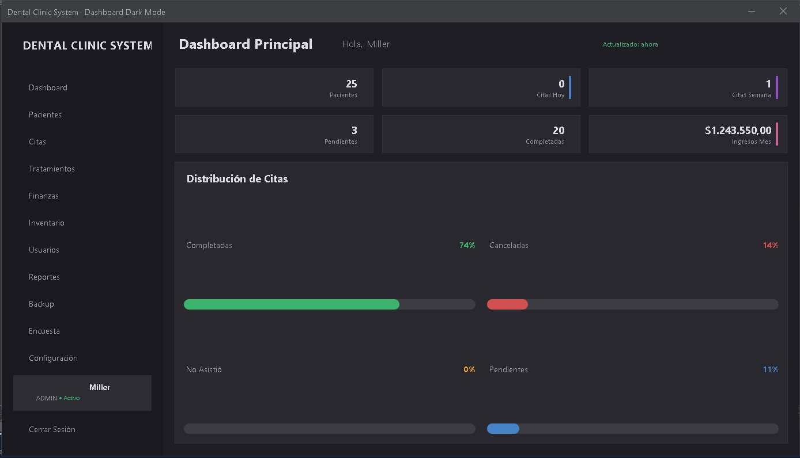

# Dental Clinic System

**Sistema Integral de Gestión para Clínicas Dentales** - Administración de pacientes, citas con alertas automáticas (WhatsApp/Email), inventario de insumos dentales, ventas de tratamientos/servicios y facturación en PDF.


<div align="center">
  <br>
  
</div>

---

## 📋 Descripción

**Dental Clinic System** es una aplicación de escritorio desarrollada en Java que optimiza la gestión completa de una clínica dental. El sistema permite administrar pacientes, agendar citas con **alertas automáticas vía WhatsApp y email**, controlar el inventario de insumos dentales, realizar ventas de tratamientos y servicios, y generar **facturas profesionales en formato PDF**.

**Ventaja clave:** Utiliza **SQLite** como motor de base de datos → No necesita instalación de servidor, es ultrarrápido y todo el sistema se puede llevar en un USB.

---

## ✨ Características Principales

| Módulo | Funcionalidades |
|--------|----------------|
| 👤 **Pacientes** | Registro completo, historial clínico, odontograma digital, búsqueda avanzada |
| 🦷 **Citas** | Agenda visual por odontólogo, confirmación automática, recordatorios, cancelación |
| 📱 **Alertas WhatsApp** | Confirmación de cita, recordatorio 24h antes, aviso de cancelación |
| ✉️ **Alertas Email** | Bienvenida, confirmación de cita, recordatorios, promociones |
| 📦 **Inventario** | Control de stock (materiales dentales, implantes, instrumental), alertas de stock bajo |
| 💰 **Ventas** | Venta de tratamientos + insumos, carrito de compra, múltiples formas de pago |
| 🧾 **Facturación PDF** | Generación automática de facturas profesionales con logo, datos de la clínica, detalle de venta |
| 👨‍⚕️ **Odontólogos** | Gestión de profesionales por especialidad (Ortodoncia, Endodoncia, Periodoncia, etc.) |
| 📊 **Reportes** | Ventas diarias/semanales/mensuales, tratamientos más realizados, ingresos por odontólogo |
| 💾 **Backup Integrado** | Copia de seguridad de la base de datos SQLite con un clic |
| 🔐 **Licencias** | Sistema de activación con HWID y fecha de expiración |
| 📋 **Términos y Condiciones** | Aceptación obligatoria al primer inicio |

---

## 🖼️ Galería de Imágenes

### Dashboard Principal


---

## 🛠️ Tecnologías Utilizadas

| Tecnología | Versión | Propósito |
|------------|---------|------------|
| Java | 17+ | Lenguaje principal |
| Swing | - | Interfaz gráfica de usuario |
| SQLite | 3.36+ | Base de datos embebida |
| JDBC (sqlite-jdbc) | 3.42.0+ | Conexión a SQLite |
| iTextPDF / Apache PDFBox | 5.5+ | Generación de facturas PDF |
| JavaMail API | 1.6+ | Envío de correos electrónicos |
| BCrypt | 0.4+ | Encriptación de contraseñas |
| FlatLaf | 2.0+ | Tema moderno para interfaz |
| Maven | 3.8+ | Gestión de dependencias |

---

## 📦 Requisitos Previos

**¡Mínimos requisitos!** Solo necesitas:

- [Java JDK/JRE 17 o superior](https://www.oracle.com/java/technologies/downloads/)
- [Git](https://git-scm.com/) (opcional, para clonar)
- Credenciales SMTP (Gmail, Outlook, etc. para email)

> ✅ **No necesitas instalar MySQL ni ningún servidor de base de datos. SQLite va incluido en el proyecto.**

---

## 🚀 Instalación y Ejecución

### 1️⃣ Descargar o clonar el proyecto

```bash
git clone https://github.com/tu-usuario/DentalClinicSystem.git
cd DentalClinicSystem